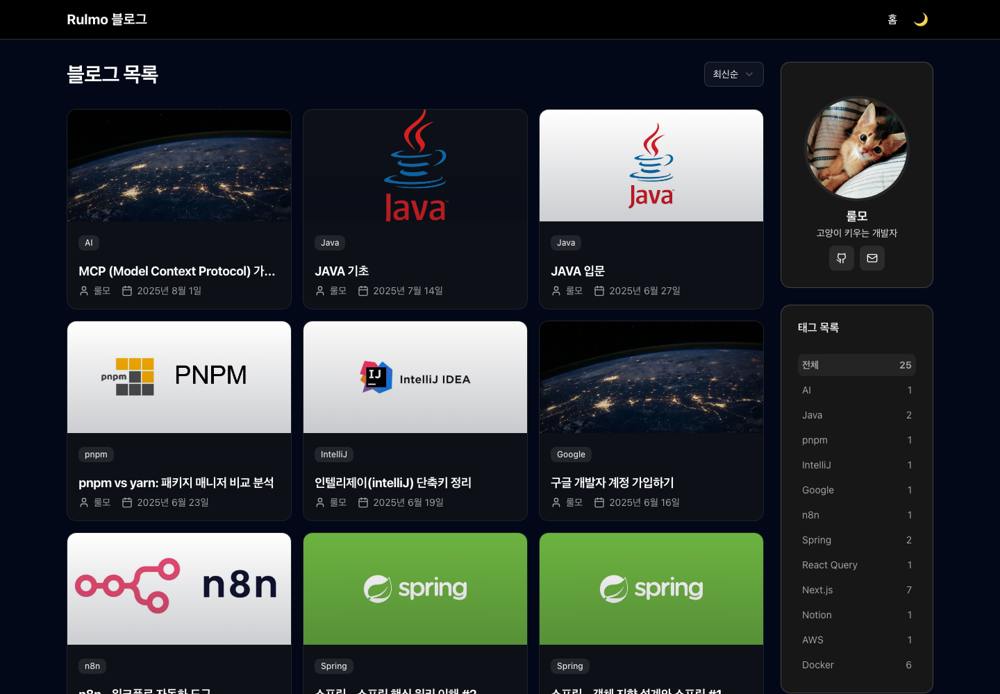
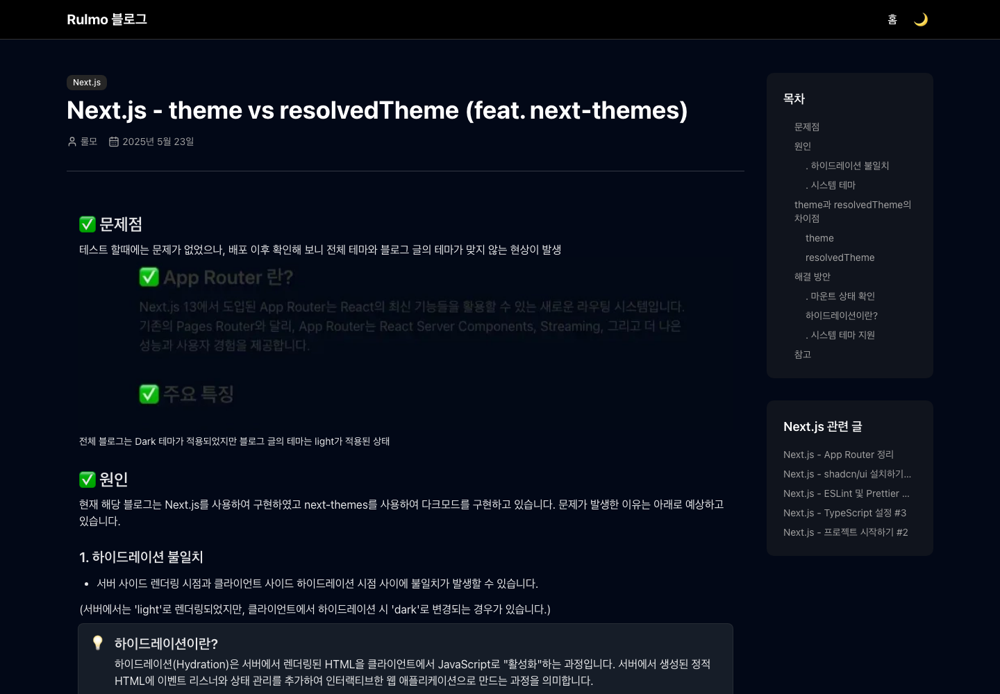

# Rulmo 블로그

[](https://github.com/Rulrulmo/notion-blog/actions/workflows/ci.yml)

Notion을 CMS로 쓰는 개인 기술 블로그입니다. Notion에 글을 쓰고 `status`를 `Published`로 바꾸면 사이트에 반영됩니다.

**https://rulmo.vercel.app**

<p align="center">
  
  
</p>

## 주요 기능

- Notion DB 기반 글 관리, 3분 주기 ISR로 자동 반영
- 태그 필터, 최신순/오래된순 정렬
- 목차(PC 사이드바, 모바일 토글), 이전/다음 글, 같은 태그의 관련 글
- 다크 모드
- Giscus(GitHub Discussions) 댓글
- Supabase 기반 조회수 (IP 기준 중복 방지)
- 글별 메타데이터와 OG 이미지, sitemap, robots
- Google AdSense

## 기술 스택

- **프레임워크**: Next.js 16 (App Router), React 19, TypeScript
- **스타일링**: Tailwind CSS v4, shadcn/ui
- **CMS**: Notion API(`@notionhq/client`) + `react-notion-x`
- **DB**: Supabase (조회수)
- **댓글**: Giscus
- **배포**: Vercel, GitHub Actions(lint, typecheck)

## 성능

Lighthouse 13, 홈 화면 기준 (2026-10-07 측정)

|          | Performance | Accessibility | Best Practices | SEO |
| -------- | :---------: | :-----------: | :------------: | :-: |
| 모바일   |     91      |      100      |       77       | 100 |
| 데스크톱 |     99      |      100      |       77       | 100 |

모바일 Performance는 3회 측정 중앙값입니다. Best Practices는 AdSense의 서드파티 쿠키 때문에 감점됩니다.

## 구조

```
app/
├── page.tsx                 # 홈: 글 목록 + 태그 (서버 렌더링)
├── blog/[slug]/page.tsx     # 글 상세 (ISR)
├── api/views/route.ts       # 조회수 기록/조회
├── sitemap.ts, robots.ts
components/                  # 공용 컴포넌트, shadcn/ui
lib/notion.ts                # Notion 데이터 접근
```

### 데이터 흐름

- 발행된 글 전체를 한 번 조회해서 `unstable_cache`로 3분간 캐시합니다.
- 홈 목록, 태그 집계, 글 상세 메타데이터, 이전/다음 글, sitemap은 모두 이 캐시를 공유합니다. 그래서 Notion API 호출이 거의 늘지 않습니다.
- 본문은 `notion-client`(Notion 비공식 API)로 페이지의 recordMap을 받아 `react-notion-x`로 렌더링합니다. 그래서 **Notion 페이지가 웹에 공개되어 있어야** 합니다.
- Notion 파일 URL은 일정 시간 뒤 만료됩니다. 그래서 커버 이미지는 공개 Notion 사이트의 이미지 프록시 주소(`NEXT_PUBLIC_NOTION_SITE_URL`)로 바꿔서 씁니다.

## 트러블슈팅

| 문제                                                                   | 원인                                                                                                           | 해결                                                                                         |
| ---------------------------------------------------------------------- | -------------------------------------------------------------------------------------------------------------- | -------------------------------------------------------------------------------------------- |
| 일정 시간 뒤 커버 이미지가 깨짐                                        | Notion API가 주는 파일 URL은 서명된 S3 주소라 1시간 뒤 만료됨                                                  | 공개 Notion 사이트의 이미지 프록시 주소로 변환 ([관련 글](https://rulmo.vercel.app/blog/19)) |
| 배포 후 글 본문만 라이트 테마로 보임                                   | 서버 렌더링과 하이드레이션 시점의 테마 불일치, `theme`이 `system`을 그대로 반환                                | 마운트 이후 `resolvedTheme` 기준으로 렌더링 ([관련 글](https://rulmo.vercel.app/blog/21))    |
| Notion에 글을 올려도 목록이 바뀌지 않음                                | `unstable_cache`에 `revalidate`가 없어 재배포 전까지 캐시가 유지됨                                             | 3분 revalidate 추가, 발행 글 조회를 한 곳으로 모아 캐시 공유                                 |
| Next 16 업그레이드 후 Vercel 빌드 실패 (`Expected a non-empty string`) | env가 없으면 `images.remotePatterns`의 hostname이 빈 문자열이 되고, Next 16은 이를 빌드 시 정규식으로 컴파일함 | env가 있을 때만 패턴을 추가                                                                  |
| 프로덕션 의존성 취약점 53개 (critical 4개)                             | Next 15.2.5의 RSC 원격 코드 실행 취약점 등                                                                     | Next 16, React 19.3으로 업그레이드하고 미사용 의존성 정리 (57개 → 32개)                      |

## 시작하기

### 필수 조건

- Node.js 20.9 이상, pnpm
- Notion integration 토큰과 아래 스키마의 DB
- Supabase 프로젝트 (조회수용 RPC 함수)

### Notion DB 스키마

| 속성          | 타입         | 설명                       |
| ------------- | ------------ | -------------------------- |
| `제목`        | Title        | 글 제목                    |
| `status`      | Select       | `Published`인 글만 노출    |
| `publishDate` | Date         | 작성일, 정렬 기준          |
| `tags`        | Multi-select | 태그                       |
| `author`      | Created by   | 작성자                     |
| `slug`        | ID           | URL(`/blog/{slug}`)에 사용 |

### Supabase RPC

- `new_visitor(page_pathname, user_ip)`: 방문 기록
- `get_views(page_pathname)`: `{ viewCount }` 반환

### 실행

```bash
pnpm install
cp .env.example .env.local   # 값 채우기
pnpm dev                     # http://localhost:3001
```

## 스크립트

- `pnpm dev`: 개발 서버 실행
- `pnpm build` / `pnpm start`: 프로덕션 빌드 / 실행
- `pnpm lint`: ESLint 실행
- `pnpm typecheck`: 타입 검사
- `pnpm format`: Prettier 포맷팅

## 라이선스

MIT
